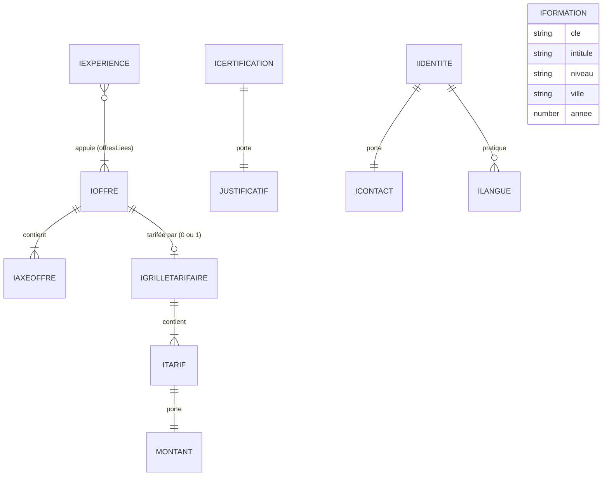

# Modèle de données

Le site n'a **pas de base de données** (arbitrage justifié dans
[`architecture.md`](./architecture.md)). Le modèle décrit ici est celui du **contenu
éditorial** : des structures TypeScript versionnées dans le dépôt, validées par des
schémas Zod au chargement du module.

> **Le contenu éditorial est de la donnée, pas du JSX.** Ajouter une offre, une
> expérience ou une certification ne demande pas de toucher au rendu.

## Où vit quoi

| Rôle | Emplacement |
|------|-------------|
| Interfaces d'entités (`IXxx`, une par fichier) | `front/src/interfaces/` |
| Alias de types purs (unions, unions discriminées) | `front/src/interfaces/types.ts` |
| Schémas Zod (un par entité, type dérivé par `z.infer`) | `front/src/schemas/` |
| Jeu de données éditorial | `front/src/content/` |
| Contrat de formulaire de contact (partagé front/back) | `shared/interfaces/`, `shared/schemas/` |

Point d'entrée unique du contenu : `front/src/content/index.ts`.

## Entités

| Entité | Rôle | Relations |
|--------|------|-----------|
| `IOffre` | Une des trois offres de service. Porte l'accroche et la **décision** que la prestation permet de trancher. | Contient 1..n `IAxeOffre`. Référencée par `IExperience.offresLiees`. |
| `IAxeOffre` | Un axe de travail à l'intérieur d'une offre : ce qui est fait, la preuve qui l'appuie, et le `volet` auquel il appartient le cas échéant. | Appartient à une `IOffre`. |
| `IGrilleTarifaire` | Les prix publiés pour une offre, et l'argument qui les rend cohérents. Une seule existe : celle de **SEA**. | Pointe vers une `IOffre` (`offre`), contient 1..n `ITarif`, porte une `IReferencePreuve`. |
| `ITarif` | Une ligne tarifaire : la prestation, sa condition d'application, son `Montant`. | Appartient à une `IGrilleTarifaire`. |
| `IExperience` | Une expérience professionnelle du parcours. | Pointe vers 1..n `IOffre` via `offresLiees` (clés `CleOffre`). |
| `IFormation` | Un diplôme obtenu. | Aucune. |
| `ICertification` | Une certification et son justificatif officiel. | Porte un `Justificatif` (union discriminée). |
| `IIdentite` | L'identité professionnelle publique : nom, titre, ville, promesse, profils. Alimente les métadonnées et le JSON-LD. | Porte un `IContact` et 0..n `ILangue`. |
| `IContact` | Les coordonnées directes : e-mail et téléphone. | Appartient à `IIdentite`. |
| `ILangue` | Une compétence linguistique : niveau, référentiel, organisme évaluateur. | Appartient à `IIdentite`. |



### Clés et identité

- Chaque entité porte une `cle` en minuscules, chiffres et tirets (`^[a-z0-9-]+$`),
  stable dans le temps : elle sert d'identifiant, d'ancre et de segment d'URL.
- `CleOffre` est une union fermée : `'ingenierie-web' | 'data-ia' | 'sea'`. Une
  `offresLiees` pointant vers une offre inexistante ne compile pas.
- La troisième clé était `seo-sea` jusqu'au 2026-08-08 (issue #16). Le référencement
  naturel n'étant pas une prestation vendue, l'offre est devenue `sea` et l'axe « SEO
  technique » a rejoint `ingenierie-web` sous la clé `seo-ready`, comme **propriété du
  livrable**. L'union étant fermée et reprise à l'identique dans quatre schémas Zod
  (`offre`, `accueil`, `experience`), le renommage ne pouvait pas être partiel : une clé
  oubliée ne compile pas, et une référence de preuve orpheline casse le build.

## Contraintes d'intégrité

Elles sont portées **deux fois** : par le typage (à la compilation) et par le schéma Zod
(au chargement). Les schémas sont des `z.strictObject` : toute clé inconnue est rejetée.

| Contrainte | Où |
|------------|-----|
| Aucune chaîne vide (`min(1)`) sur tous les libellés | schémas Zod |
| Une offre a au moins un axe ; une expérience au moins un fait | schémas Zod |
| `IAxeOffre.volet` est optionnel mais jamais vide s'il est présent | `axe-offre.schema.ts` |
| `anneeFin >= anneeDebut` sur une expérience | `experience.schema.ts` (`refine`) |
| `maximum > minimum` sur une fourchette de prix | `tarif.schema.ts` (`refine`) |
| Montants en euros **entiers et positifs** (pas de centimes, pas de zéro) | `tarif.schema.ts` |
| Une grille tarifaire a au moins une ligne | `grille-tarifaire.schema.ts` |
| Années bornées à `2000..2100`, entières | schémas Zod |
| Aucune clé inconnue dans une entité | `z.strictObject` |

## Règle de véracité portée par le typage

Plusieurs règles du [`CLAUDE.md`](../CLAUDE.md) ne sont pas laissées à la vigilance du
rédacteur : elles sont **rendues impossibles à enfreindre** par le modèle.

### 1. Pas de lien de certification mort ou inventé

`Justificatif` (dans `front/src/interfaces/types.ts`) est une **union discriminée** :

```ts
export type Justificatif =
  | { readonly statut: 'disponible'; readonly url: string }
  | { readonly statut: 'a-fournir' }
```

La variante `a-fournir` **ne porte aucune propriété `url`**. Conséquences :

- lire `certification.justificatif.url` sans narrowing préalable est une **erreur de
  compilation** (`TS2339`) — le rendu ne peut pas produire un lien vers rien ;
- écrire une `url` sur une certification `a-fournir` est une **erreur de compilation**
  (`TS2353`), et le `z.strictObject` la rejetterait aussi **au chargement** ;
- une URL `disponible` doit être absolue et en **HTTPS** (`z.url().startsWith('https://')`).

**À ce jour, aucune URL de justificatif n'est connue : les cinq certifications sont
toutes en `a-fournir`.** Elles ne pourront afficher un lien qu'une fois les URLs
officielles transmises par Jérôme MARICHEZ.

### 2. Pas de chiffre approché

- `ICertification.annee` est `number | null`. `null` signifie « année **non établie** » —
  jamais une valeur approchée. Une seule certification est dans ce cas aujourd'hui :
  Google Ads, datée 2021 sur deux CV et 2022 sur le troisième — arbitrage du 2026-08-08,
  aucune année n'est affichée.
- `IAxeOffre.preuve` est `string | null`. `null` signifie « aucune preuve publiable » :
  la ligne éditoriale impose de reformuler ou de supprimer plutôt que d'inventer.

### 3. Une coordonnée, une seule écriture

`IContact` est le **point unique** des coordonnées : e-mail et téléphone n'existent nulle
part ailleurs dans le code — ni dans un composant, ni dans un `mailto:`, ni dans le
JSON-LD.

| Donnée | Forme stockée | Validation | Forme dérivée |
|--------|---------------|------------|---------------|
| E-mail | adresse telle quelle | `z.email()` | — |
| Téléphone | format national `0X XX XX XX XX` | `TELEPHONE_NATIONAL_FR` | E.164 (`+33…`) par `utils/telephone.ts` |

*(Les valeurs elles-mêmes ne sont pas recopiées ici : elles vivent dans
`front/src/content/identite.ts`, et nulle part ailleurs.)*

Le format international **n'est pas saisi une seconde fois** : `telephoneVersE164()` le
dérive du numéro national, et le motif qui valide la donnée est celui-là même qui
autorise la conversion. Deux écritures d'un même numéro finiraient par diverger, et la
seconde — celle que seules les machines lisent — divergerait en silence.

### 4. Une langue n'est pas une certification

`ILangue` existe pour que la distinction soit **structurelle** et non éditoriale : les CV
de référence classent « Anglais, B2 (EF SET, CECRL) » sous *Langues*. EF SET est le test
qui évalue le niveau, pas un titre obtenu. La compétence part donc dans `knowsLanguage`
du JSON-LD, jamais dans `hasCredential` — où elle aurait gonflé la liste des
certifications d'une ligne indue.

### 5. Pas de montant sans sa mention fiscale

Un prix publié engage Jérôme vis-à-vis d'un prospect, et un prix sans mention fiscale est
ambigu — l'ambiguïté se paie au premier échange commercial. La mention n'est donc pas une
consigne de rédaction : c'est une **propriété du montant**, absente des variantes qui ne
portent aucun chiffre. `Montant` (dans `front/src/interfaces/types.ts`) est bâti comme
`Justificatif` :

```ts
export type Montant =
  | { readonly nature: 'inclus' }
  | {
      readonly nature: 'fourchette'
      readonly minimum: number
      readonly maximum: number
      readonly mentionFiscale: MentionFiscale
      readonly periodicite: Periodicite
      readonly variableSelon: string
    }
  | { readonly nature: 'sur-devis'; readonly periodicite: Periodicite }
```

Conséquences, toutes vérifiées :

- écrire une fourchette **sans** `mentionFiscale` est une **erreur de compilation**
  (`TS2322` — *Property 'mentionFiscale' is missing … but required*) ;
- écrire une `mentionFiscale` sur une ligne `inclus` ou `sur-devis` — là où il n'y a
  aucun montant à taxer — est une **erreur de compilation** (`TS2353`), et le
  `z.strictObject` la rejetterait aussi **au chargement** ;
- lire `montant.minimum` sans narrowing sur `nature === 'fourchette'` ne compile pas : un
  rendu ne peut pas afficher un chiffre qui n'existe pas ;
- `MentionFiscale` vaut `'TTC'` et rien d'autre. L'arbitrage rendu (2026-08-08) est
  *toutes taxes comprises* ; publier du hors taxes serait un **second arbitrage
  commercial**, qui passerait par une modification explicite du type, relue en PR ;
- une fourchette inversée est refusée **au build** par le `refine` de `tarif.schema.ts`,
  avec le message *« La borne haute d'une fourchette doit être strictement supérieure à
  la borne basse. »* — l'égalité est refusée aussi : deux bornes identiques ne sont pas
  une estimation, c'est un prix ferme déguisé.

Côté **rendu**, la garantie est prolongée par `front/src/utils/tarif.ts`, seul module qui
transforme un `Montant` en texte. Il émet toujours le chiffre et sa mention d'un seul
tenant (« 300 à 1 200 € TTC, une seule fois, selon le périmètre ») ; la fonction qui met
en forme les euros **n'est pas exportée**, il n'existe donc aucun moyen d'obtenir un
montant nu. Sa sortie porte un type marqué, `MontantAffichable` : un composant qui déclare
ce type en propriété ne peut pas recevoir un prix écrit à la main dans du JSX.

### 6. Un montant, une seule écriture

Comme pour les coordonnées, les montants ne sont **saisis qu'une fois**, dans
`front/src/content/offres/sea-tarifs.ts`. Ni le [`README.md`](../README.md), ni ce
document, ni une page ne les recopient : ils décrivent la grille — incluse, fourchette
TTC une seule fois selon le périmètre, forfait mensuel sur devis — et renvoient au
fichier. Deux écritures d'un même prix finissent par diverger, et c'est la copie oubliée
qui se retrouve devant le prospect.

La grille est rattachée à son offre par `IGrilleTarifaire.offre` plutôt que d'être un
champ obligatoire d'`IOffre` : **Data & IA est entièrement sur devis** et Ingénierie Web
n'a pas d'arbitrage rendu. Un champ obligatoire aurait forcé à inventer des montants là
où il n'y en a pas ; l'absence de grille est ici une information, pas un trou.

L'argument commercial qui justifie la gratuité de la mise en place vit dans
`IGrilleTarifaire.argument`, à la première personne du singulier, et la preuve chiffrée
qui l'appuie est **désignée** par `IReferencePreuve` (offre `sea`, axe `sea-pilotage`) et
non recopiée : les budgets pilotés et les prestataires encadrés restent écrits à un seul
endroit, dans l'offre.

## Validation au chargement

Chaque module de `front/src/content/` **valide ses données à l'import** :

```ts
const donnees = { /* ... */ } satisfies IOffre
export const offreIngenierieWeb: IOffre = offreSchema.parse(donnees)
```

Trois filets, dans cet ordre :

1. `satisfies IOffre` — la forme est vérifiée **à la compilation** ;
2. `offreSchema.parse(...)` — les invariants (chaînes non vides, bornes, clés inconnues)
   sont vérifiés **au chargement du module** ;
3. l'annotation `: IOffre` sur le résultat du `parse` force TypeScript à vérifier que le
   **schéma et l'interface décrivent bien la même forme**. Une divergence entre les deux
   ne compile pas.

Le contenu étant prérendu (SSG), ce chargement a lieu **au build** : une donnée non
conforme casse le build, jamais la production.

## Règles générales

- **Pas de binaire en base** : les images et fichiers sont des **références**
  (URL / chemin d'asset), jamais des BLOB.
- Le contenu est versionné dans le dépôt : toute évolution éditoriale est **relisible en
  revue de PR**, au même titre que le code.
- Pas de migration : il n'y a pas de persistance à faire évoluer.
