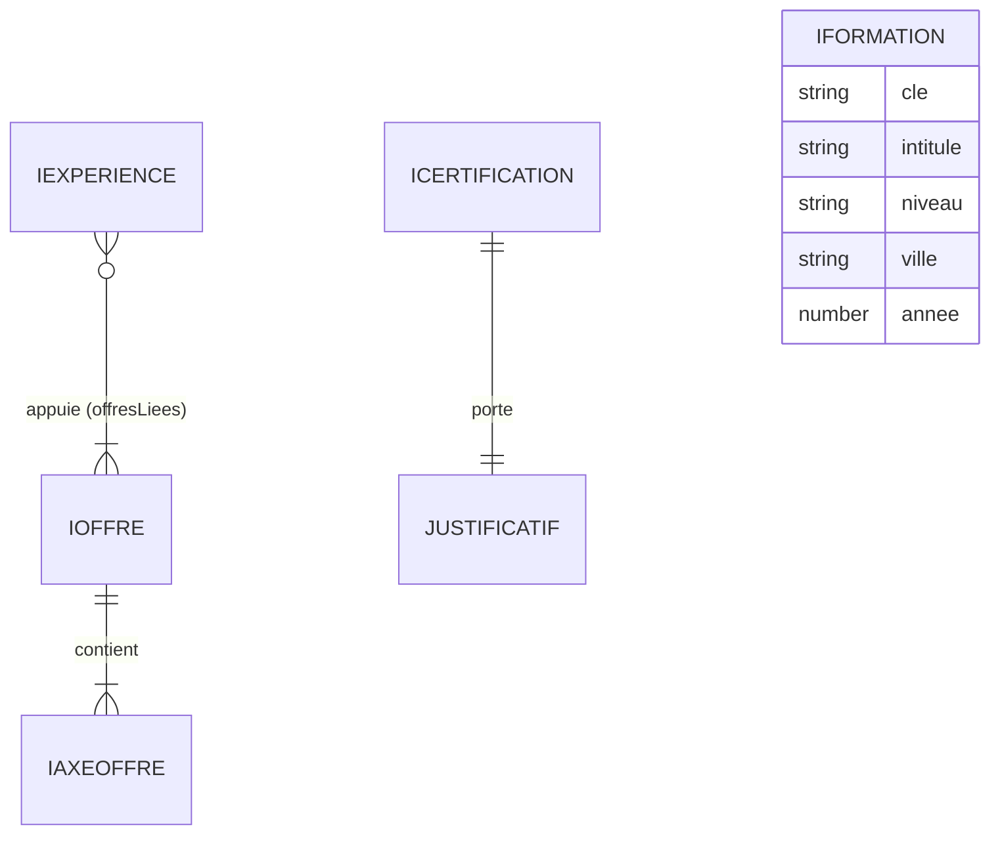

# Modèle de données

Le site n'a **pas de base de données** (arbitrage justifié dans
[`architecture.md`](./architecture.md)). Le modèle décrit ici est celui du **contenu
éditorial** : des structures TypeScript versionnées dans le dépôt, validées par des
schémas Zod au chargement du module.

> **Le contenu éditorial est de la donnée, pas du JSX.** Ajouter une offre, une
> expérience ou une certification ne demande pas de toucher au rendu.

## Où vit quoi

| Rôle | Emplacement |
|------|-------------|
| Interfaces d'entités (`IXxx`, une par fichier) | `front/src/interfaces/` |
| Alias de types purs (unions, unions discriminées) | `front/src/interfaces/types.ts` |
| Schémas Zod (un par entité, type dérivé par `z.infer`) | `front/src/schemas/` |
| Jeu de données éditorial | `front/src/content/` |
| Contrat de formulaire de contact (partagé front/back) | `shared/interfaces/`, `shared/schemas/` |

Point d'entrée unique du contenu : `front/src/content/index.ts`.

## Entités

| Entité | Rôle | Relations |
|--------|------|-----------|
| `IOffre` | Une des trois offres de service. Porte l'accroche et la **décision** que la prestation permet de trancher. | Contient 1..n `IAxeOffre`. Référencée par `IExperience.offresLiees`. |
| `IAxeOffre` | Un axe de travail à l'intérieur d'une offre : ce qui est fait, et la preuve qui l'appuie. | Appartient à une `IOffre`. |
| `IExperience` | Une expérience professionnelle du parcours. | Pointe vers 1..n `IOffre` via `offresLiees` (clés `CleOffre`). |
| `IFormation` | Un diplôme obtenu. | Aucune. |
| `ICertification` | Une certification et son justificatif officiel. | Porte un `Justificatif` (union discriminée). |



### Clés et identité

- Chaque entité porte une `cle` en minuscules, chiffres et tirets (`^[a-z0-9-]+$`),
  stable dans le temps : elle sert d'identifiant, d'ancre et de segment d'URL.
- `CleOffre` est une union fermée : `'ingenierie-web' | 'data-ia' | 'seo-sea'`. Une
  `offresLiees` pointant vers une offre inexistante ne compile pas.

## Contraintes d'intégrité

Elles sont portées **deux fois** : par le typage (à la compilation) et par le schéma Zod
(au chargement). Les schémas sont des `z.strictObject` : toute clé inconnue est rejetée.

| Contrainte | Où |
|------------|-----|
| Aucune chaîne vide (`min(1)`) sur tous les libellés | schémas Zod |
| Une offre a au moins un axe ; une expérience au moins un fait | schémas Zod |
| `anneeFin >= anneeDebut` sur une expérience | `experience.schema.ts` (`refine`) |
| Années bornées à `2000..2100`, entières | schémas Zod |
| Aucune clé inconnue dans une entité | `z.strictObject` |

## Règle de véracité portée par le typage

Deux règles du [`CLAUDE.md`](../CLAUDE.md) ne sont pas laissées à la vigilance du
rédacteur : elles sont **rendues impossibles à enfreindre** par le modèle.

### 1. Pas de lien de certification mort ou inventé

`Justificatif` (dans `front/src/interfaces/types.ts`) est une **union discriminée** :

```ts
export type Justificatif =
  | { readonly statut: 'disponible'; readonly url: string }
  | { readonly statut: 'a-fournir' }
```

La variante `a-fournir` **ne porte aucune propriété `url`**. Conséquences :

- lire `certification.justificatif.url` sans narrowing préalable est une **erreur de
  compilation** (`TS2339`) — le rendu ne peut pas produire un lien vers rien ;
- écrire une `url` sur une certification `a-fournir` est une **erreur de compilation**
  (`TS2353`), et le `z.strictObject` la rejetterait aussi **au chargement** ;
- une URL `disponible` doit être absolue et en **HTTPS** (`z.url().startsWith('https://')`).

**À ce jour, aucune URL de justificatif n'est connue : les six certifications sont
toutes en `a-fournir`.** Elles ne pourront afficher un lien qu'une fois les URLs
officielles transmises par Jérôme MARICHEZ.

### 2. Pas de chiffre approché

- `ICertification.annee` est `number | null`. `null` signifie « année **non établie** » —
  jamais une valeur approchée. Deux certifications sont dans ce cas aujourd'hui
  (Google Ads, daté différemment selon les CV ; EF SET, daté nulle part).
- `IAxeOffre.preuve` est `string | null`. `null` signifie « aucune preuve publiable » :
  la ligne éditoriale impose de reformuler ou de supprimer plutôt que d'inventer.

## Validation au chargement

Chaque module de `front/src/content/` **valide ses données à l'import** :

```ts
const donnees = { /* ... */ } satisfies IOffre
export const offreIngenierieWeb: IOffre = offreSchema.parse(donnees)
```

Trois filets, dans cet ordre :

1. `satisfies IOffre` — la forme est vérifiée **à la compilation** ;
2. `offreSchema.parse(...)` — les invariants (chaînes non vides, bornes, clés inconnues)
   sont vérifiés **au chargement du module** ;
3. l'annotation `: IOffre` sur le résultat du `parse` force TypeScript à vérifier que le
   **schéma et l'interface décrivent bien la même forme**. Une divergence entre les deux
   ne compile pas.

Le contenu étant prérendu (SSG), ce chargement a lieu **au build** : une donnée non
conforme casse le build, jamais la production.

## Règles générales

- **Pas de binaire en base** : les images et fichiers sont des **références**
  (URL / chemin d'asset), jamais des BLOB.
- Le contenu est versionné dans le dépôt : toute évolution éditoriale est **relisible en
  revue de PR**, au même titre que le code.
- Pas de migration : il n'y a pas de persistance à faire évoluer.
